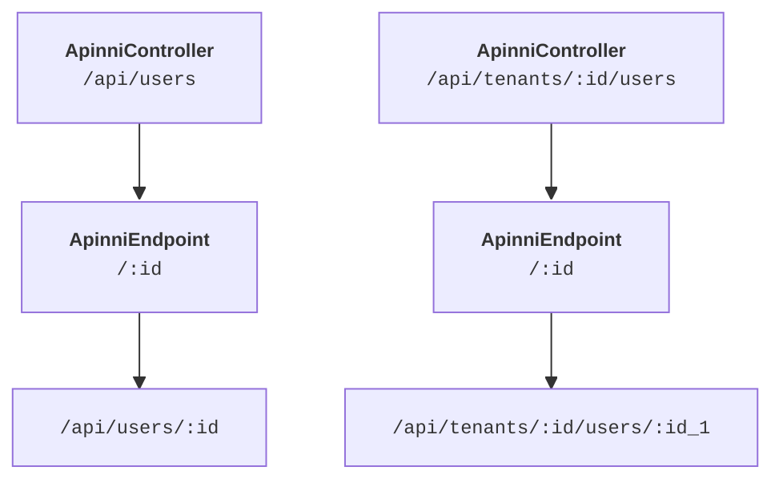

import Tabs from '@theme/Tabs';
import TabItem from '@theme/TabItem';
import Admonition from '@theme/Admonition';

# ApinniController Decorator

The `@ApinniController` decorator marks a TypeScript class as an API controller, defining a **base path** for all endpoints within the class. It integrates with the Apinni pipeline to provide type-safe routing and works in tandem with the [`@ApinniEndpoint`](/docs/decorators/apinni-endpoint) decorator to define individual API endpoints. This decorator is essential for organizing API routes under a common prefix, ensuring modularity and maintainability in your API structure.

<Admonition type="info" title="Key Features">
- Defines a type-safe base path for all endpoints in a controller.
- Supports parameterized paths (e.g., `/:tenantId`).
- Integrates seamlessly with `@ApinniEndpoint` for endpoint definitions.
- Enables modular API design with clear route hierarchies.
</Admonition>

## Syntax

Use the `@ApinniController` decorator to annotate a class, specifying the base path for its endpoints.

```ts title="Basic Syntax"
@ApinniController({ path: '/api/users' })
class UserController {}
```

## Options

The decorator accepts an options object with the following property:

| Property | Type     | Description                                                                 |
|----------|----------|-----------------------------------------------------------------------------|
| `path`   | `string` | The base path for all endpoints in the controller (e.g., `/api/users`). Supports type-safe parameterized paths with `:param` notation. |

<Admonition type="tip">
Use `:param` notation in the `path` to define dynamic segments. TypeScript ensures unique parameter names for type safety, preventing errors like duplicate parameters.
</Admonition>

## Controller-Endpoint Relationship

The `@ApinniController` decorator sets the base path for all endpoints defined within the class using `@ApinniEndpoint`. The final endpoint path is constructed by concatenating the controller’s base path with the endpoint’s specific path.



## Usage with ApinniEndpoint

The `@ApinniController` decorator is typically used with `@ApinniEndpoint` to define a complete API route structure. The controller provides the base path, while each endpoint specifies its relative path and HTTP method.

### Example 1: Basic Controller with Endpoint

Define a controller with a single GET endpoint.

```ts title="Basic Controller"
import { ApinniController, ApinniEndpoint } from 'apinni';

@ApinniController({ path: '/api/users' })
class UserController {
  @ApinniEndpoint({ path: '/:id', method: 'GET' })
  getUserById() {
    return { id: '123', name: 'User' };
  }
}
```

<Admonition type="info" title="example">
- **Base Path**: `/api/users`
- **Endpoint Path**: `/:id`
- **Final Path**: `/api/users/:id`
- **HTTP Method**: `GET`
</Admonition>

### Example 2: Parameterized Base Path

Use a parameterized base path for multi-tenant APIs.

```ts title="Parameterized Base Path"
import { ApinniController, ApinniEndpoint } from 'apinni';

@ApinniController({ path: '/api/tenants/:tenantId/users' })
class UserController {
  @ApinniEndpoint({ path: '/:userId', method: 'GET' })
  getUserById() {
    return { id: '123', name: 'User' };
  }
}
```

<Admonition type="info" title="example">
- **Base Path**: `/api/tenants/:tenantId/users`
- **Endpoint Path**: `/:userId`
- **Final Path**: `/api/tenants/:tenantId/users/:userId`
- **HTTP Method**: `GET`
</Admonition>

### Example 3: Multiple Endpoints in a Controller

Define multiple endpoints within a single controller.

<Tabs>
  <TabItem value="multiple-endpoints" label="Multiple Endpoints" default>
    ```ts title="Multiple Endpoints"
    import { ApinniController, ApinniEndpoint } from 'apinni';

    type UserRequest = { id: string };
    type UserResponse = { id: string; name: string };

    @ApinniController({ path: '/api/users' })
    class UserController {
      @ApinniEndpoint({ path: '/:id', method: 'GET' })
      getUserById(): UserResponse {
        return { id: '123', name: 'User' };
      }

      @ApinniEndpoint({ path: '/', method: 'POST', request: { model: 'UserRequest' } })
      createUser() {
        return { id: '456', name: 'New User' };
      }
    }
    ```

    <Admonition type="info" title="example">
    - **GET Endpoint**: `/api/users/:id` (returns `UserResponse`)
    - **POST Endpoint**: `/api/users` (accepts `UserRequest`)
    </Admonition>
  </TabItem>
</Tabs>

## Usage Notes

- **Path Concatenation**: The controller’s `path` is prepended to each endpoint’s `path`. Ensure paths are unique to avoid conflicts.
- **Params Validation**: Apinni validates parameterized paths to prevent duplicate parameters (e.g., `:id` used twice in the same path) both in `ApinniController` level and on concatenation level.
- **Modularity**: Use multiple controllers to organize APIs by resource (e.g., `UserController`, `OrderController`).
- **Integration**: Combine with [`@ApinniDomain`](/docs/decorators/apinni-domain) to define endpoints within specific domains.

<Admonition type="warning">
Ensure the `path` option is a valid string and avoid duplicate paths names to avoid generation issues.
</Admonition>

<Admonition type="tip" title="Try It Out">
Explore these examples in a live TypeScript environment: [CodeSandbox Link](#).
</Admonition>

## Related Topics

- [ApinniEndpoint](/docs/decorators/apinni-endpoint) – Define individual endpoints within a controller.

<Admonition type="info">
For advanced use cases, check the [Apinni API Reference](/docs/api-reference) or contact the [Apinni community](https://community.apinni.dev).
</Admonition>